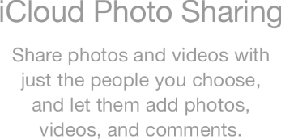
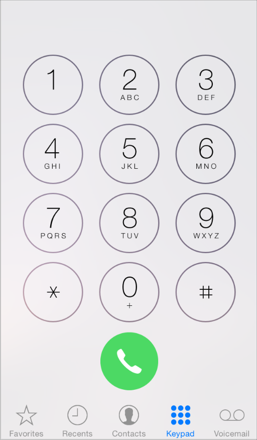

# 控件 - Controls
## 活动指示器(Activity Indicator)
活动指示器表明任务或进程正在进行中，如下图所示。  

>API提示：  
若想要了解如何在代码中定义活动指示器，可以参考[UIActivityIndicatorView Class Reference](https://developer.apple.com/library/ios/documentation/UIKit/Reference/UIActivityIndicatorView_Class/index.html#//apple_ref/doc/uid/TP40006830).  

活动指示器：  
-	当任务进行和加载时旋转，任务完成后自动消失
-	不支持用户交互行为  

在工具栏或主视图中使用活动指示器来告知用户任务或加载正在进行中，但并不提示该过程何时会结束。  
不要使用静止的活动指示器。用户会以为该进程停滞了。  
用活动指示器来让用户知道进程仍在进行中。有些时候，告诉用户进程没有停止比告诉他们何时完成更加重要。  
可以的话，最好可以设计一个与应用的风格协调的活动指示器。根据背景风格给活动指示器选择合适的尺寸和颜色。  
  
## 添加联系人按钮(Contact Add Button)
添加联系人按钮让用户将现有联系人添加到文本框或者其它文字视图中。  
 
 
>API提示：  
若想要了解如何在代码中定义添加联系人按钮，参考[Buttons](https://developer.apple.com/library/ios/documentation/UserExperience/Conceptual/UIKitUICatalog/UIButton.html#//apple_ref/doc/uid/TP40012857-UIButton).  
 
添加联系人按钮：  
-	显示联系人列表
-	帮助用户将一个联系人添加到当前联系人按钮所在的视图中  

使用添加联系人按钮让用户在不需要使用键盘的情况下就可以方便地访问到联系人。举个例子，在新建邮件的界面中，用户可以点击该按钮来添加收件人，而不需要用键盘输入收件人的名字。  
因为添加联系人按钮是用来替代用键盘输入联系人方法，所以在不支持键盘输入的界面中使用添加联系人按钮是不适用的。  

## 日期时间选择器(Date Picker)
日期时间选择器显示关于日期和时间的组件，比如小时，分钟，天，以及年。  
 
 
>API提示：  
若想要了解如何在代码中定义日期选择器，请参考 [Date Pickers](https://developer.apple.com/library/ios/documentation/UserExperience/Conceptual/UIKitUICatalog/UIDatePicker.html#//apple_ref/doc/uid/TP40012857-UIDatePicker).

日期时间选择器：  
-	最多可以展示4个独立的滑轮，每一个滑轮表示一个不同的值，比如月份或小时等
-	在每个滑轮的中央使用深色字体来表示当前选中的值
-	大小不可更改（与iPhone键盘的大小相同）
-	包括四种模式，每一种模式代表了一组不同的值：
- 日期和时间。日期和时间模式（默认模式）包含日期、小时、和分钟，	  以及一个可选的AM/PM值。
- 时间。时间模式包括小时和分钟，以及可选的AM/PM值。
- 日期。日期模式包括月份，天以及年三个值。
- 倒计时器。倒计时器模式显示了小时和分钟值。你可以精确地设定倒计时间的总时长，倒计时的最大值为23小时59分钟。  

使用日期时间选择器来让用户选择时间，而不是让用户自己输入一个包含了日期、时间等多个部分的时间值。  
尽量地让用户在当前界面中使用日期选择器。最好避免用户在使用日期选择器的时候要进入另外一个界面。在iPad上，日期时间选择器可能会出现在一个浮层中，或者嵌入在当前内容里。  
有必要的时候，改变分钟滑轮的单位刻度。在默认情况下，分钟滑轮包含从0到59共60个值，如果你要展示一个颗粒度较大的时间，你可以让分钟滑轮的单位刻度变大，只要这个刻度可以整除60。比如说你可能会设定每15分钟为一个刻度，此时分钟滑轮就有4个值，0、15、30、45。  

## 详情展开按钮(Detail Disclosure Button)  
详情展开按钮展示了与该项相关的更多详细信息与功能描述。
 
 
>API提示：
若想要了解如何在代码中定义详情展开按钮，可以参考 [UITableViewCell Class Reference](https://developer.apple.com/library/ios/documentation/UIKit/Reference/UITableViewCell_Class/index.html#//apple_ref/doc/uid/TP40006938) 和[Buttons](https://developer.apple.com/library/ios/documentation/UserExperience/Conceptual/UIKitUICatalog/UIButton.html#//apple_ref/doc/uid/TP40012857-UIButton).
  
详情展开按钮以一个单独的视图展示特定项目的更多详情信息与功能。  
当详情展开按钮在表格行中出现时，点击表格行的其它区域不会激活此按钮，只会选中该行，或者触发app中其它自定义的行为。  
一般来说，你会在一个表格视图中使用详情展开按钮来让用户知道更多关于这个列表项的信息。当然你也可以将这个按钮用在其它类型的视图中来为用户展示更多与特定项目相关的信息和功能。  

## 信息按钮(Info Button)
信息按钮展示了app的配置信息，有时候它会出现在当前视图的背面。
 
 
>API提示：
若想要了解如何在代码中定义信息按钮，可以参考[Buttons](https://developer.apple.com/library/ios/documentation/UserExperience/Conceptual/UIKitUICatalog/UIButton.html#//apple_ref/doc/uid/TP40012857-UIButton).  

iOS包含了两种信息按钮样式：适用于浅色内容上的深色按钮，以及适用于深色内容上的浅色按钮。  
使用信息按钮来显示app的配置信息或选项。你可以根据自己app的UI风格来选择最为协调的信息按钮样式。  

## 标签(Label)
标签用于显示静态文本。
 
 
>API提示：  
若想要了解如何在代码中定义标签，可以参考[UILabel Class Reference](https://developer.apple.com/library/ios/documentation/UIKit/Reference/UILabel_Class/index.html#//apple_ref/doc/uid/TP40006797).

标签可以：  
-	显示任意数量的静态文本
-	不支持除了文本复制以外的任何用户交互行为  

你可以使用标签来命名或描述你的部分UI，又或者用它来给用户提供一些简单的信息。标签最适合拿来展示相对简单的文本信息。  
保证你的标签清晰易读。最好支持动态文本(Dynamic Type)，并使用 [UIFont](https://developer.apple.com/library/ios/documentation/UIKit/Reference/UIFont_Class/index.html#//apple_ref/occ/cl/UIFont) 中的preferredFontForTextStyle来获得标签中的展示文本。如果你要用自定义字体的话，请慎重选择字体种类，不要以牺牲清晰度为代价来换取花哨的颜色和字体效果。（想要了解关于app中字体使用的指南，可以参考 [Color and Typography](https://developer.apple.com/library/ios/documentation/UserExperience/Conceptual/MobileHIG/ColorImagesText.html#//apple_ref/doc/uid/TP40006556-CH58-SW1);想要了解更多动态文本的内容，可以参考 [Text Programming Guide for iOS](https://developer.apple.com/library/ios/documentation/UserExperience/Conceptual/MobileHIG/ColorImagesText.html#//apple_ref/doc/uid/TP40006556-CH58-SW1) 里面 的 [Text Styles](https://developer.apple.com/library/ios/documentation/StringsTextFonts/Conceptual/TextAndWebiPhoneOS/CustomTextProcessing/CustomTextProcessing.html#//apple_ref/doc/uid/TP40009542-CH4-SW65) 部分。）  

## 网络活动指示器(Network Activity Indicator)
网络活动指示器在状态栏中出现，表示网络活动正在进行。
 
 
>API提示：  
你可以在代码中使用 UIApplication 方法[networkActivityIndicatorVisible](https://developer.apple.com/library/ios/documentation/UIKit/Reference/UIApplication_Class/index.html#//apple_ref/occ/instm/UIApplication/isNetworkActivityIndicatorVisible)来控制该活动指示器的可见性。                         

网络活动指示器：
-	出现在状态栏中，当网络活动正在进行时它会旋转，在活动停止时它则消失
-	不支持用户交互行为

当你的app正在链接网络，而这个连接过程将会持续好几秒的时候，你可以通过网络活动指示器来给用户以反馈。如果进程所需时间很短，则不必要使用它，因为很可能在用户注意到它之前，它就消失了。  

## 页面控件(Page Control)
页面控件告诉用户当前共打开了多少个视图，还有他们正停留在哪一个视图。
 
 
>API提示：  
想要了解如何在代码中定义页面控件，可以参考 [Page Controls](https://developer.apple.com/library/ios/documentation/UIKit/Reference/UIApplication_Class/index.html#//apple_ref/occ/instm/UIApplication/isNetworkActivityIndicatorVisible).  

页面控件：
-	显示一系列圆点，每个圆点对应一个已经打开的视图（从左到右，高亮的圆点代表了视图打开的先后顺序）。
-	默认情况下，使用不透明点来标识当前打开的视图，使用半透明点来表示所有其它视图。
-	不支持用户访问不连续的视图
-	当视图数量超过页面宽度可承载的范围时，点的大小和间距并不会因此变小，如果需要显示的点超过一定数量，系统会把它截断。
-	系统默认不支持视图间的切换，你必须自己实现两个视图的切换并适时更新页面控件的状态。 

当你的目的是让用户知道一共打开了多少个视图而不是帮助他们选择一个视图时，也就是当你的app中所有的视图都属于同级的时候，你可以使页面控件。  
当你的app结构存在信息层级，请不要使用页面控件。因为页面控件不显示视图之间的关系，也不能让用户跟踪自己的访问路径回到上一级。  
避免显示太多的点。10个点以上就会让用户一眼看不过来，在app里打开20个视图是非常耗时的。如果用户真的需要打开20个视图，你就该好好想想其他办法怎样显示更多内容了。 
将页面控件垂直居中放置于当前打开视图的底边与屏幕底边之间，这样可以保证它的可见性而又不会对内容造成干扰。  

## 选择器(Picker)
选择器展示了一组值，用户可以从中选择一个。
 
>API提示：若想要了解如何在代码中定义选择器，请参考[UIPickerView Class Reference](https://developer.apple.com/library/ios/documentation/UIKit/Reference/UIPickerView_Class/index.html#//apple_ref/doc/uid/TP40006842).  

选择器：
-	是日期时间选择器的通用模式
-	包括一个或多个滑轮，每个滑轮含有一组值
-	以深色标识在中间表示当前选中的值
-	不可以自定义大小（选择器的大小与iPhone的键盘相同）

使用选择器可以让用户更容易从一组不同的值中间进行选择。  
一般来说，当用户对整组值都比较熟悉的时候，可以使用选择器。由于当滑轮静止的时候，大部分的数值会被隐藏，最好是在用户对所有数值均有预期的情况下才使用选择器。当你需要展示一大组用户并不熟悉的选项，此种选择器可能不太适合。  
尽可能让让用户在当前视图中使用选择器。不要让他们在使用选择器时还要进入其它的视图。  
如果你需要展示的备选项数量很多，考虑使用表格视图(Table View)而不是选择器。因为表格视图的高度较大，内容滚动起来会更快。  

## 进度视图（Progress View）
进度视图展示了任务或进程的进度（下图是iOS默认的邮件App的工具栏）。
 
 
>API提示：  
若想要了解更多如何在代码中定义进度视图，参考[UIProgressView Class Reference](https://developer.apple.com/library/ios/documentation/UIKit/Reference/UIPickerView_Class/index.html#//apple_ref/doc/uid/TP40006842).  

进度视图：
-	是一条轨迹，随着进程的进行从左向右进行填充
-	不支持用户交互行为

iOS定义了两种进度视图样式：
-	默认(Default).默认样式适合用在app的主要内容区中。 
-	进度条(Bar).此样式比默认样式细，适合用在工具栏中。 

当一个任务存在明确的进程，可以使用进度条来给与用户反馈，尤其是告诉用户这个任务大约需要多少时间才能完成。
可以的话，请根据你的app的风格来设计进度条的外观。你可以自定义进度条的底色以及轨迹颜色，也可以直接使用图片。

## 刷新控件(Refresh Control)
刷新控件执行用户触发的内容刷新——一个典型的例子，它常在表格中出现（下图展示的是iOS默认的邮件app的mailbox列表页）。
 
 
>API提示：  
若想要了解如何在代码中定义刷新控件，请参考[UIRefreshControl Class Reference](https://developer.apple.com/library/ios/documentation/UIKit/Reference/UIRefreshControl_class/index.html#//apple_ref/doc/uid/TP40012250).  

刷新控件：
-	看起来类似活动指示器
-	可以显示一个标题
-	默认状态下不可见，当用户在表格上缘往下拖拽以刷新内容时才出现

就算你使用了刷新控件，也不要因此就不支持内容自动刷新。尽管用户喜欢在执行刷新操作时内容立刻刷新，他们也同样会喜欢内容自动刷新。如果过于依赖用户自己执行所有刷新操作的话，那些不会自动刷新的用户就会疑惑，为何你app中的数据永远都不更新。一般来说，刷新控件给了用户多一个选择，让他们可以立刻获得最新的内容，但同时，你也不能奢望用户会主动获取所有的更新信息。  
只有在必要的时候才加短标题。特别需要注意的是，不要使用短标题来描述刷新控件怎么使用。

## 圆角矩形按钮(Rounded Rectangle Button)
iOS 7已经不再使用圆角矩形按钮，而是使用了新的系统按钮——类型为UIButtonTypeSystem的UI按钮([UIButton](https://developer.apple.com/library/ios/documentation/UIKit/Reference/UIButton_Class/index.html#//apple_ref/occ/cl/UIButton)).使用指南可参考[System Button](https://developer.apple.com/library/ios/documentation/UserExperience/Conceptual/MobileHIG/Controls.html#//apple_ref/doc/uid/TP40006556-CH15-SW10).

## 分段控件(Segmented Control)
分段控件是一组分段的线性集合，每一个分段的作用类似按钮，点击之后将切换到相应的视图。
 
 
>API提示：  
想要了解如何在代码中定义分段控件，请参考 [Segmented Controls](https://developer.apple.com/library/ios/documentation/UserExperience/Conceptual/UIKitUICatalog/UISegmentedControl.html#//apple_ref/doc/uid/TP40012857-UISegmentedControl).  

分段控件：
-	由两个或以上的分段组成，根据需要分段的数量按比例分成宽度相同的小段
-	可以包含文字或者图片

使用分段控件来提供密切相关而又互斥的选项。  
保证每个分段都容易点击。为了保证每个分段的大小有至少44×44像素，要控制分段的数量。在iPhone上，1个分段控件最多包含5个分段。  
尽可能地保持每个分段中的文字长度一致。因为每个分段都是等宽的，当文本长度差异很大时看上去会很不协调。  
不要在同一个分段控件中混用文字和图片。每一个分段都仅可支持纯文字或纯图片。避免在同一个分段控件中，一些分段里使用纯文字，另一些分段里使用纯图。  
如果你自定义了分段控件的外观，请在必要时调整分段控件中文本的对齐方式。如果你给分段控件添加了自定义底图，请确保控件里自动居中的文本依然整洁美观。你可以通过bar metrics APIs 来调整分段控件内文本的对齐方式(想要了解如何定义bar metrics，可以参考[UISegmentedControl](https://developer.apple.com/library/ios/documentation/UserExperience/Conceptual/UIKitUICatalog/UISegmentedControl.html#//apple_ref/doc/uid/TP40012857-UISegmentedControl) 中关于自定义API外观(appearance-customization APIs)的描述)。

## 滑块(Slider)
滑块允许用户在一个限定范围内调整某个数值或进程(下图展示的是iOS设置中亮度设置的滑块，滑块的左边和右边均为自定义图形)。
 
 
>API提示：  
若想要了解如何在代码中定义滑块，请参考 [Sliders](https://developer.apple.com/library/ios/documentation/UserExperience/Conceptual/UIKitUICatalog/UISegmentedControl.html#//apple_ref/doc/uid/TP40012857-UISegmentedControl).  

-	由一条水平的轨迹和Thumb(滑块中支持用户水平拖拽的圆形控件)组成
-	支持使用自定义图片来直观的显示左边和右边对应的最小值与最大值的含义
-	左边缘最小值到Thumb之间的部分是填充轨道

使用滑块来让用户精准地选择自己想要的值，或者控制当前的进程。

如果合适的话，自定义滑块的外观。比如，你可以：  
-	定义Thumb的外观，让用户一看就知道滑块当前的状态
-	在轨迹的左右两端使用自定义图片分别代表最小值和最大值，让用户直观的感受这个滑块的用途。比如说，一个图调整图片尺寸的滑块可以在最小值的左边放一张小图，在最大值的右边放一张大图。
-	根据Thumb所在的位置和当前滑块的状态来为滑块的轨迹定义不同的颜色
  
不要用滑块控制音量。若你需要控制音量，请调用[MPVolumeView](https://developer.apple.com/library/ios/documentation/UserExperience/Conceptual/UIKitUICatalog/UISegmentedControl.html#//apple_ref/doc/uid/TP40012857-UISegmentedControl)类使用系统自带的音量滑块。如果当前音频输出设备不支持音量控制，音量滑块会被适合的设备代替。

## 步进器(Stepper)
步进器可以以常数为幅度来增减当前数值。
 
 
>API提示：  
若想要了解如何在代码中定义步进器，请参考 [Steppers](https://developer.apple.com/library/ios/documentation/UserExperience/Conceptual/UIKitUICatalog/UIStepper.html#//apple_ref/doc/uid/TP40012857-UIStepper).

步进器：
-	是一个两段控件，其中一段默认显示减号，另一端默认显示加号
-	支持自定义图片
-	不展示用户更改的值

当用户想要对数值进行小幅度调整时，可以使用步进器.  
**当用户需要大幅度调整数值的时候，不要使用步进器。**用户可能会在打印机里使用步进器来确定打印份数，因为这个值的变化幅度通常并不大；而当用户需要选择打印的页码范围时，使用步进器就会让操作变得繁琐，因为用户很可能要点很多下才能选定页数。  
**要保证步进器所调整的值明确可见。**步进器自身不展示任何数值，所以你需要保证让用户知道他们正在调整哪一个数值。  

## 开关按钮(Switch)
一个开关按钮展示了两个互斥的选项或状态。  
    
  

>API提示：  
若想要了解如何在代码中定义开关，参考 [Switches](https://developer.apple.com/library/ios/documentation/UserExperience/Conceptual/UIKitUICatalog/UISwitch.html#//apple_ref/doc/uid/TP40012857-UISwitch).

开关按钮：
-	显示了一个项存在的二元状态
-	仅在表格视图中可用
在表格中使用开关按钮来让用户从某一项的两个互斥状态中指定一个，比如是/否(Yes/No)，开/关(On/Off)。  
你可以使用开关按钮来控制视图中的其它UI元素。根据用户的选择，新的列表项可能出现或者消失，或从激活状态变为不激活状态。  

## 系统按钮(System Button)
系统按钮执行app中定义的行为。
 
 
>API提示：  
在iOS 7中，UIButtonTypeRoundedRect已经被重新定义为 UIButtonTypeSystem. 如果在iOS 6中使用了圆角矩形按钮，在连接到iOS 7的时候会自动替换为新的系统按钮。想要了解如何在代码中定义系统按钮，参考 [Buttons](https://developer.apple.com/library/ios/documentation/UserExperience/Conceptual/UIKitUICatalog/UIButton.html#//apple_ref/doc/uid/TP40012857-UIButton).  

系统按钮：
-	默认状态下不含边界，也不含背景图
-	可以是图标或者文字标题
-	支持自定义样式，如描边或者加背景图(想要自定义按钮外观，可以使用 UIButtonTypeCustom 类型的按钮，并且提供背景图片)

使用系统按钮来执行某个动作。当你为系统按钮命名时，请遵循以下方法：  
-	使用动词或动词短语来描述按钮所代表的动作。这种命名方法告诉用户这个按钮是可交互的，也提示了用户点击之后会执行什么操作
-	使用标题式大写(title-style capitalization，每个单词的首字母均大写)。除了冠词，并列连词以及少于4个字母的介词外，标题中每个单词的首字母均大写。
-	标题不要太长。太长的标题会被截断，让用户难以理解其含义。
 
 
合适的话，为内容区域内的系统按钮描边或者加入背景。大多数情况下，你可以通过定义一个清晰的按钮名称、选择一个不一样的标题颜色或提供上下文情景提示来让用户知道这是一个按钮而非普通文本。但在某些特定的内容区域内，为按钮描边或者添加背景颜色，让用户迅速地把注意力放到按钮上，也是必要的。  
以iPhone为例，给数字按键添加圆形边框强化了用户拨电话号码时的心理模型，而拨号（Call）按钮的背景色让用户拥有了更明确的点击目标。

## 文本框(Text Field)
文本框支持用户输入单行的文本。
 
 
>API提示：  
若想要了解如何在代码中定义文本框，以及在文本框中支持图片和按钮，请参考 [Text Fields](https://developer.apple.com/library/ios/documentation/UserExperience/Conceptual/UIKitUICatalog/UIButton.html#//apple_ref/doc/uid/TP40012857-UIButton).  

文本框：
-	高度固定，包含圆角
-	当用户点击它时，自动唤起输入键盘
-	可以包含系统提供的按钮，如书签按钮(Bookmarks)
-	可以展示多种文字样式(了解更多请参考 [UITextView](https://developer.apple.com/library/ios/documentation/UserExperience/Conceptual/UIKitUICatalog/UIButton.html#//apple_ref/doc/uid/TP40012857-UIButton))  

使用文本框来获取用户输入的少量信息。  
**你可以自定义一个文本框，帮助用户更好地理解如何使用它。**举个例子，你可以在文本框的左侧或者右侧加入自定义图形，或者加入系统提供的按钮，如书签按钮等。一般来说，文本框的左侧用于表述文本框的含义，而右侧用于展示附加的功能，如书签。  
**合适的话，在文本框右侧加入清除按钮。**轻击清除按钮变可清空当前框内输入的全部内容，包括你原本打算在这个按钮上面展示的其它图片。  
**如果可以帮助用户理解的话，可以在文本框中加入提示文字。**当文本框里没有任何其它提示文字时，会展示占位符文本(placeholder text)，如名字、地址等。  
**根据输入内容的类型来指定不同的键盘类型。**举例来说，你希望用户能更方便地输入网址、密码或者电话号码。iOS提供了各种不同的键盘类型，以便用户输入不同类型的文本。想要了解可用键盘类型，可以参考[UITextInputTraits Protocol Reference](https://developer.apple.com/library/ios/documentation/UserExperience/Conceptual/UIKitUICatalog/UIButton.html#//apple_ref/doc/uid/TP40012857-UIButton)中的[UIKeyboardType]().想要了解如何在管理你的应用中的键盘，请参考[iOS App Programming Guide](https://developer.apple.com/library/ios/documentation/UserExperience/Conceptual/UIKitUICatalog/UIButton.html#//apple_ref/doc/uid/TP40012857-UIButton)中的[Managing the Keyboard](https://developer.apple.com/library/ios/documentation/UserExperience/Conceptual/UIKitUICatalog/UIButton.html#//apple_ref/doc/uid/TP40012857-UIButton)部分。但请注意，由于键盘的布局以及输入方法是由用户的系统语言设置决定的，这部分是你不能控制的。

